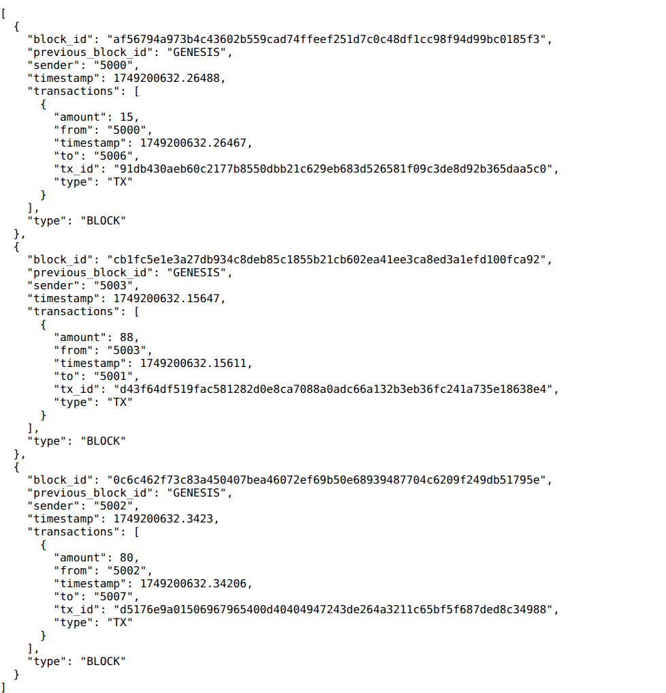
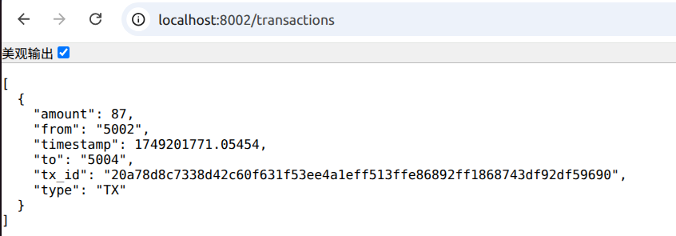
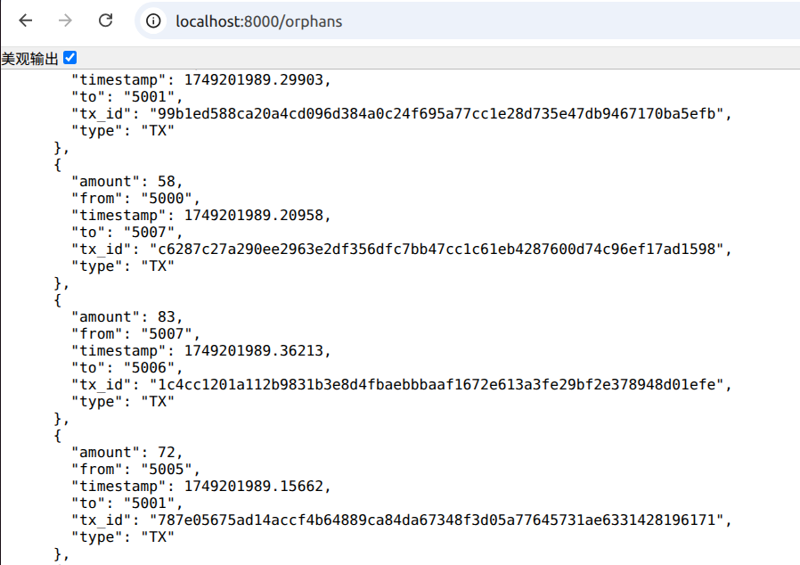
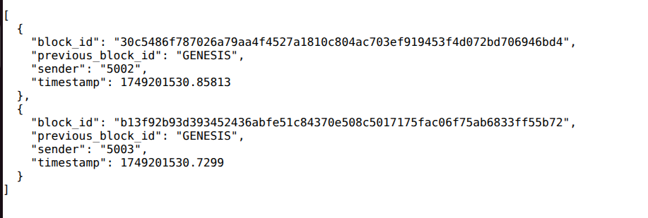
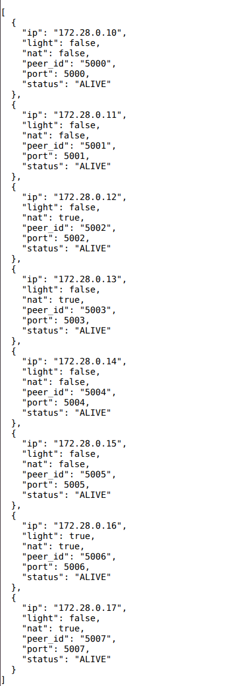
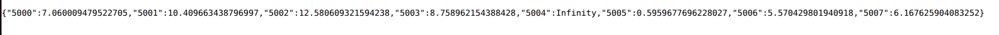
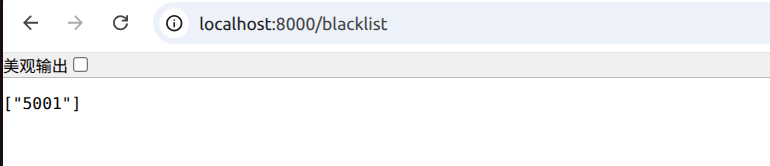
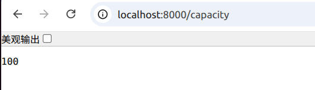
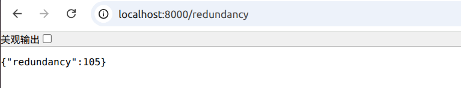
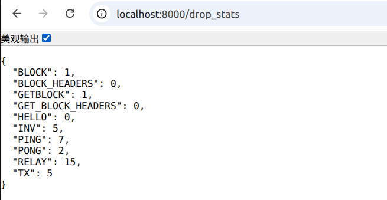

# CS305 2025 Spring Final Project - Blockchain Network Simulation Report

> 本项目托管于Github，访问链接：https://github.com/OptimistiCompound/SUSTech_CS305_BlockChain

#### 小组成员：钟庸，陈佳林，倪汇智

### 负责工作
||工作|
|:-:|:-:|
|钟庸   | socket_server.py, peer_discovery.py, outbox.py, message_handler.py |
|陈佳林 | peer_manager.py, block_handler.py, inv_message.py, transaction.py, dashboard.py |
|倪汇智 | |

## 各模块实现

## Part 1: Peer Initialization (`socket_server.py`)

创建TCP socket，绑定到ip和port，开始监听。
- 每当收到消息后，使用 `json.loads` 解析消息，并调用 `dispatch_message` 进行分发处理。
- 若收到空消息或无效 JSON，会直接跳过或打印错误日志，保证服务稳定。

```python

RECV_BUFFER = 4096

def start_socket_server(self_id, self_ip, port):

    def listen_loop():
        # Create a TCP socket and bind it to the peer’s IP address and port.
        peer_socket = socket.socket(socket.AF_INET, socket.SOCK_STREAM)
        peer_socket.setsockopt(socket.SOL_SOCKET, socket.SO_REUSEADDR, 1)
        peer_socket.bind((self_ip, port))
        peer_socket.listen()
        print(f"Listening on {self_ip}:{port}")
        # When receiving messages, pass the messages to the function `dispatch_message` in `message_handler.py`.
        while True:
            try:
                conn, addr = peer_socket.accept()
                conn.settimeout(10)  # 防止死等
                with conn:  # 使用with确保连接正确关闭
                    try:
                        # 用文件对象逐行读取
                        f = conn.makefile()
                        for line in f:
                            line = line.strip()
                            if not line:
                                continue
                            try:
                                msg_dict = json.loads(line)
                                dispatch_message(msg_dict, self_id, self_ip)
                            except json.JSONDecodeError:
                                print(f"从{addr}接收到无效JSON数据: {line}")
                    except Exception as e:
                        print(f"❌ Error receiving message: {e} in peer {self_id} at {self_ip}:{port}")
            except Exception as e:
                print(f"🔻 Error accepting connection: {e} in peer {self_id} at {self_ip}:{port}")
                continue

    # ✅ Run listener in background
    threading.Thread(target=listen_loop, daemon=True).start()
```


## Part 2: Peer Discovery

### `Peer_discovery.py`

在 peer 初始化的时候，调用start_peer_discovery，开始进行peer discovery。start_peer_discovery会根据 peer_config 创建reachable_peer_list：
- 通过两层循环，计算每个 peer 的 reachable_by 集合，表示哪些 peer 能到达该节点（考虑 NAT 和局域网约束）。
- 非 NAT 节点可被所有节点到达。
NAT 节点只能被同局域网的节点到达。
创建 reachable_peer_list, 全局一致。然后启动一个线程，每隔DISCOVERY_INTERVAL秒调用一次discover_peers。discover_peers会遍历reachable_peer_list，向每个peer发送 HELLO 消息，然后等待响应。收到响应后，会调用handle_discover_response处理响应:
- 如果 sender 不在 known_peer 中, 会将该节点加入到该节点的 known_peer 中。
- 如果 sender 不再 reachable_by[self_id] 中，会将该节点加入到 reachable_by[self_id] 中。

```python
def start_peer_discovery(self_id, self_info):
    ...
    ...
        for peer_id in peer_config:
            reachable_by[peer_id] = set()

        for target_id, target_info in peer_config.items():
            for candidate_id, candidate_info in peer_config.items():
                if candidate_id == target_id:
                    continue
                target_nat = target_info.get("nat", False)
                candidate_nat = candidate_info.get("nat", False)
                target_localnet = target_info.get("localnetworkid", -1)
                candidate_localnet = candidate_info.get("localnetworkid", -1)
                # 非NAT peer
                if not target_nat:
                    if not candidate_nat:
                        reachable_by[target_id].add(candidate_id)
                    else:
                        if target_localnet == candidate_localnet:
                            reachable_by[target_id].add(candidate_id)
                # NAT peer只能被同局域网peer到达
                else:
                    if target_localnet == candidate_localnet:
                        reachable_by[target_id].add(candidate_id)


def handle_hello_message(msg, self_id):
    ...
    # If the sender is unknown, add it to the list of known peers (`known_peer`) and record their flags (`peer_flags`).
    if sender_id not in known_peers:
        known_peers[sender_id] = (sender_ip, sender_port)
        peer_flags[sender_id] = {
            "nat": sender_nat,
            "light": sender_light
        }
        new_peers.append(sender_id)
    ...

    # Update the set of reachable peers (`reachable_by`).
    if sender_id not in reachable_by[self_id]:
        reachable_by[self_id].add(sender_id)
```


### `Peer_manager.py`

该模块负责监控各节点存活状态、管理 RTT 延迟信息，并实现简单的黑名单封禁机制。

主要功能：

- `start_ping_loop(self_id, peer_table, interval=15)`：周期性向所有已知节点发送 PING 消息，检测节点是否在线。
- `handle_pong(msg)`：收到 PONG 响应后，测量 RTT 延迟并更新节点活性状态。
- `start_peer_monitor(timeout=10, check_interval=2)`：定时检测节点是否超时未响应，及时将失联节点标记为 "UNREACHABLE"。
- 黑名单机制：统计恶意行为（如非法区块），超过阈值自动将节点加入黑名单，确保网络安全与健壮性。

```python
def start_ping_loop(self_id, peer_table, interval=15):
    def loop():
       while True:
            cur_time = time.time()
            for peer_id, (ip, port) in peer_table.items():
                if peer_id == self_id:
                    continue
                msg = {
                    "type": "PING",
                    "sender": self_id,
                    "timestamp": cur_time,
                    "message_id": generate_message_id()
                }
                enqueue_message(peer_id, ip, port, msg)
            time.sleep(interval)
    threading.Thread(target=loop, daemon=True).start()

def handle_pong(msg):
    sender = msg.get("sender")
    sent_ts = msg.get("timestamp")
    now = time.time()
    if sender is not None and sent_ts is not None:
        rtt = now - sent_ts
        rtt_tracker[sender] = rtt
        update_peer_heartbeat(sender)
```
```python
def record_offense(peer_id):
    peer_offense_counts[peer_id] += 1
    if peer_offense_counts[peer_id] > 0:
        blacklist.add(peer_id)
        print(f"[{peer_id}] has been added to the blacklist due to repeated offenses.")
```


## Part 3: Block and Transaction Generation and Verification

### `Block_handler.py`

主要负责生成区块和验证区块。
- `block_generation` `create_dummy_block` 函数用于生成一个新的区块。
- `handle_block` 函数用于接收区块，验证其block_id的合法性，并将其添加到 `received_blocks` 列表中。如果收到同一个peer的不合法消息超过3个，将其记作恶意节点。如果收到的块没有匹配的上一个block的id，将其加入到 `orphan_blocks` 列表中。


```python
def block_generation(self_id, MALICIOUS_MODE, interval=20):
    from inv_message import create_inv
    def mine():
        while True:
            # 创建新区块
            block = create_dummy_block(self_id, MALICIOUS_MODE)
            if block is not None:
                # 生成INV消息并广播
                inv_msg = create_inv([block["block_id"]], self_id)
                gossip_message([peer for peer in known_peers if peer != self_id], inv_msg)
            time.sleep(interval)
    threading.Thread(target=mine, daemon=True).start()
```

对于新生成的block，通过`outbox.py` 中的 `gossip_message`函数，将block广播给已知节点。

```python
def gossip_message(self_id, message, fanout=3):

    from peer_discovery import known_peers, peer_config, peer_flags
    selected_peers = set()
    for peer in peer_config:
        if peer == self_id:
            continue
        light = peer_flags[peer].get("light", False)
        if light and message["type"] == "TX":
            continue
        selected_peers.add(peer)
        if len(selected_peers) == fanout:
            break
    for peer in selected_peers:
        enqueue_message(peer, known_peers[peer][0], known_peers[peer][1], message)
```

```python
def handle_block(msg, self_id):
    block_id = msg.get("block_id")
    expected_hash = compute_block_hash(msg)
    if block_id != expected_hash:
        record_offense(msg.get("sender"))
        print(f"Invalid block ID {block_id} from {msg.get('sender')}, expected {expected_hash}")
        return False
    if any(b["block_id"] == block_id for b in received_blocks):
        return False
    prev_id = msg.get("previous_block_id")
    if prev_id != "GENESIS" and not any(b["block_id"] == prev_id for b in received_blocks):
        orphan_blocks[block_id] = msg
        return False
    receive_block(msg)
    return True
```

### `transaction.py`

该模块负责生成、验证交易，并维护本地交易池。

主要功能：

- `TransactionMessage` 类：封装了交易的各项属性（发送者、接收者、金额、时间戳、唯一哈希 ID 等），便于序列化和网络传输。
- `transaction_generation(self_id, interval=15)`：周期性自动生成并广播新的交易消息，每隔一定时间随机生成一次，模拟真实网络的交易流量。
- `add_transaction(tx)`：去重后将新交易加入本地交易池。
- `get_recent_transactions()`：返回交易池内所有交易的字典列表，用于状态展示与区块打包。
- `clear_pool()`：打包新区块后清空交易池。

```python
class TransactionMessage:
    def __init__(self, sender, receiver, amount, timestamp=None):
        self.type = "TX"
        self.from_peer = sender
        self.to_peer = receiver
        self.amount = amount
        self.timestamp = timestamp if timestamp else time.time()
        self.id = self.compute_hash()
    def compute_hash(self):
        tx_data = {
            "type": self.type,
            "from": self.from_peer,
            "to": self.to_peer,
            "amount": self.amount,
            "timestamp": self.timestamp
        }
        return hashlib.sha256(json.dumps(tx_data, sort_keys=True).encode()).hexdigest()
    def to_dict(self):
        return {
            "type": self.type,
            "tx_id": self.id,
            "from": self.from_peer,
            "to": self.to_peer,
            "amount": self.amount,
            "timestamp": self.timestamp
        }
```
```python
def transaction_generation(self_id, interval=15):
    def loop():
        while True:
            candidates = [peer for peer in known_peers if peer != self_id]
            if not candidates:
                time.sleep(interval)
                continue
            to_peer = random.choice(candidates)
            amount = random.randint(1, 100)
            tx = TransactionMessage(self_id, to_peer, amount)
            add_transaction(tx)
            gossip_message([peer for peer in known_peers if peer != self_id], tx.to_dict())
            time.sleep(interval)
    threading.Thread(target=loop, daemon=True).start()
```


### `inv_message.py`

该模块负责区块链网络中区块广播、同步的 INV 消息机制。

主要功能如下：

- `create_inv(block_ids, sender_id)`：根据给定的区块 ID 列表和发送者 ID 构建 INV 消息（格式为字典），用于通知其他节点有新块可同步。
- `get_inventory()`：返回本节点已持有的所有区块 ID 列表。
- `broadcast_inventory(self_id)`：自动构建 INV 消息并向所有其他已知节点广播，告知新获得的区块信息，实现区块间的快速同步。

**实现要点：**
- 利用 `gossip_message()` 完成消息的广播，自动排除自身节点，保证消息只发送给其他节点。
- 与区块生成、区块请求等模块协同，实现区块链主链的全网同步。

```python
def create_inv(block_ids, sender_id):
    return {
        "type": "INV",
        "sender": sender_id,
        "block_ids": block_ids,
        "message_id": generate_message_id()
    }

def broadcast_inventory(self_id):
    inv_msg = create_inv(get_inventory(), self_id)
    peer_ids = [peer_id for peer_id in known_peers if peer_id != self_id]
    gossip_message(peer_ids, inv_msg)
```


## Part 4: Sending Message Processing (outbox.py)

负责消息的发送。维护一个消息队列 queue，用于存储待发送的消息。
发送消息的时候按照优先级发送,当优先级高的消息没有发送完的时候,会先发送优先级高的消息,当优先级高的消息发送完了,才发送优先级低的消息。
如果发送目的节点不可达,是nat节点,会将消息发送发给对应的relay节点,然后通过relay节点的消息队列forwarding给最终的nat节点。

其他文件通过调用 `enqueue_message` 函数，将消息加入到消息队列中，而具体的发送逻辑在`outbox.py`中实现。
```python
def enqueue_message(target_id, ip, port, message):
    from peer_manager import blacklist, rtt_tracker

    # Check if the peer sends message to the receiver too frequently using the function `is_rate_limited`. If yes, drop the message.
    # Check if the receiver exists in the `blacklist`. If yes, drop the message.
    # Classify the priority of the sending messages based on the message type using the function `classify_priority`.
    # Add the message to the queue (`queues`) if the length of the queue is within the limit `QUEUE_LIMIT`, or otherwise, drop the message.
    if is_rate_limited(target_id):
        return
    if target_id in blacklist:
        return
    priority = classify_priority(message)

    if message["type"] == "HELLO":
        print(f"🟢 Hello from {target_id}")

    with lock:
        if len(queues[target_id][priority]) < QUEUE_LIMIT:
            queues[target_id][priority].append((ip, port, message))
        else:
            print(f"[{target_id}]🈲 Drop due to queue limit")
            drop_stats[message["type"]] += 1
            return
```

具体的发送逻辑在`send_from_queue`中实现。`enqueue_message`函数会根据消息的优先级和目的节点的状态，决定是否立即发送或稍后发送。然后调用`relay_or_direct_send`函数来决定是直接发送还是通过relay节点发送。如果能够直达，直接调用`send_message`函数发送消息；如果目标是NATed peer，且自身无法直达，则通过`get_relay_peer`获取latency最低的relay节点，将原始消息封装在RELAY消息的payload里面，调用`send_message`函数发送消息。重传机制使用简单的重复发送，最多重传 3 次。如果 3 次发送都失败，则记录为丢弃。

```python
def send_from_queue(self_id):
    def worker():
        while True:  # 持续轮询
            for target_id in list(queues.keys()):
                with lock:
                    if (queues[target_id]["HIGH"] or queues[target_id]["MEDIUM"] or queues[target_id]["LOW"]):
                        ip, port, message = None, None, None
                        if queues[target_id]["HIGH"]:
                            ip, port, message = queues[target_id]["HIGH"].popleft()
                        elif queues[target_id]["MEDIUM"]:
                            ip, port, message = queues[target_id]["MEDIUM"].popleft()
                        elif queues[target_id]["LOW"]:
                            ip, port, message = queues[target_id]["LOW"].popleft()
                        else:
                            continue
                        retries[target_id] = 0
                    else:
                        continue
                
                success = relay_or_direct_send(self_id, target_id, message)

                # Retry a message if it is sent unsuccessfully and drop the message if the retry times exceed the limit `MAX_RETRIES`.
                if not success:
                    if retries[target_id] < MAX_RETRIES:
                        retries[target_id] += 1
                        print(f"Retrying: {retries[target_id]}/3")
                        time.sleep(RETRY_INTERVAL)
                        enqueue_message(target_id, ip, port, message)
                    else:
                        drop_stats[message["type"]] += 1
                        retries[target_id] = 0
                else:
                    retries[target_id] = 0
            time.sleep(0.01)  # 防止空转占用CPU

    threading.Thread(target=worker, daemon=True).start()

def relay_or_direct_send(self_id, dst_id, message):
    from peer_discovery import known_peers, peer_flags, reachable_by
    from utils import generate_message_id

    if message["type"] == "HELLO":
        print(f"🟢 Sending HELLO to {dst_id}")

    # Check if the target peer is NATed. 
    nat = peer_flags.get(dst_id, {}).get("nat", False)

    if self_id in reachable_by[dst_id]:
        return send_message(known_peers[dst_id][0], known_peers[dst_id][1], message)
    if nat:
        relay_peer = get_relay_peer(self_id, dst_id) # (peer_id, ip, port) or None
        if relay_peer:
            relay_msg = {
                "type": "RELAY",
                "sender": self_id,
                "target": dst_id,
                "payload": message,
                "message_id": generate_message_id()
            }
            return send_message(relay_peer[1], relay_peer[2], relay_msg)
        else:
            print(f"🟡 No relay peer found for {dst_id}")
            return False
    else:
        return send_message(known_peers[dst_id][0], known_peers[dst_id][1], message)
```


此外，还通过 `RateLimiter` 类来模拟真实网络的发送速率限制,并使用`apply_network_conditions`函数来应用网络条件。

```python
# === Sending Rate Limiter ===
class RateLimiter:
    def __init__(self, rate=SEND_RATE_LIMIT):
        self.capacity = rate               # Max burst size
        self.tokens = rate                # Start full
        self.refill_rate = rate           # Tokens added per second
        self.last_check = time.time()
        self.lock = Lock()

    def allow(self):
        with self.lock:
            now = time.time()
            elapsed = now - self.last_check
            self.tokens += elapsed * self.refill_rate
            self.tokens = min(self.tokens, self.capacity)
            self.last_check = now

            if self.tokens >= 1:
                self.tokens -= 1
                return True
            return False

rate_limiter = RateLimiter()

def apply_network_conditions(send_func):
    def wrapper(ip, port, message):

        # Use the function `rate_limiter.allow` to check if the peer's sending rate is out of limit. 
        # If yes, drop the message and update the drop states (`drop_stats`).
        if rate_limiter.allow() == False:
            drop_stats[message["type"]] += 1
            return False

        # Generate a random number. If it is smaller than `DROP_PROB`, drop the message to simulate the random message drop in the channel. 
        # Update the drop states (`drop_stats`).
        if random.random() < DROP_PROB:
            drop_stats[message["type"]] += 1
            return False

        # Add a random latency before sending the message to simulate message transmission delay.
        # Send the message using the function `send_func`.
        time.sleep(random.uniform(*LATENCY_MS) / 1000)
        return send_func(ip, port, message)
```

## PART 5: Receiving Message Processing (message_handler.py)

处理消息接受。主要通过`dispatch_message`方法，按照message的type来分类处理。
此外，通过维护 seen_message_ids，seen_txs，redundant_blocks，redundant_txs，message_redundancy，处理重复接受的消息。并且通过`is_inbound_limited`方法，限制消息接收的速度。

以下介绍`dispatch_message`的行为

处理PING和PONG，来更新节点是否存活。
```python
elif msg_type == "PING":
        update_peer_heartbeat(msg["sender"])
        pong_msg = create_pong(self_id, msg["timestamp"])
        target_ip, target_port = known_peers[msg["sender"]]
        enqueue_message(msg["sender"], target_ip, target_port, pong_msg)

    elif msg_type == "PONG":
        update_peer_heartbeat(msg["sender"])
        update_peer_heartbeat(self_id)
        handle_pong(msg)
```

处理INV消息，如果收到的消息的block_id不在本地的block_id列表中，就会向发送者发送getblock消息，请求缺失的block。
```python
    elif msg_type == "INV":
        local_block_ids = get_inventory() # list of block_id
        rcv_block_ids = msg.get("block_ids", [])
        missing_block_ids = [block_id for block_id in rcv_block_ids if block_id not in local_block_ids]
        if missing_block_ids:
            getblock_msg = create_getblock(self_id, missing_block_ids)
            target_ip, target_port = known_peers[msg["sender"]]
            enqueue_message(msg["sender"], target_ip, target_port, getblock_msg)
```

处理GETBLOCK消息，如果收到的消息的block_id在本地的block_id列表中，就会向发送者发送block消息；否则向已知的peers请求缺失的block。
```python
    elif msg_type == "GETBLOCK":
        print(f"[{self_id}] Received GETBLOCK from {msg['sender']}, requesting blocks: {msg.get('block_ids', [])}")

        rcv_block_ids = msg.get("block_ids", [])
        ret_blocks = []
        missing_block_ids = []

        # 1. 查找本地已有的区块
        for block_id in rcv_block_ids:
            block = get_block_by_id(block_id)
            if block:
                ret_blocks.append(block)
                print(f"{self_id} Found block: {block_id}")
            else:
                missing_block_ids.append(block_id)
                print(f"[{self_id}] Missing block: {block_id}")

        # 2. 发送本地已有区块
        for block in ret_blocks:
            try:
                # 检查序列化
                json.dumps(block)
            except Exception as e:
                print(f"[{self_id}] Block not serializable: {e}, block={block}")
                continue
            print(f"Sending BLOCK: {block['block_id']}")

            try:
                sender = msg["sender"]
            except Exception as e:
                print(f"🆘 Exception in Key")
            try:
                print(f"enqueue_message参数: sender={msg.get('sender')}, peer_config={peer_config.get(msg.get('sender'))}")
                enqueue_message(
                    sender,
                    peer_config.get(sender)["ip"],
                    peer_config.get(sender)["port"],
                    block
                )
            except Exception as e:
                print(f"🆘 Error calling enqueue_message: {e}, msg={msg}, peer_config_keys={list(peer_config.keys())}")
            

        # 3. 如果有缺失区块，向其他 peer 请求
        if missing_block_ids:
            for peer_id in known_peers:
                if peer_id == self_id:
                    continue
                get_block_msg = create_getblock(self_id, missing_block_ids)
                enqueue_message(peer_id, peer_config[peer_id]["ip"], peer_config[peer_id]["port"], get_block_msg)

            # 4. 最多重试3次，每次等待10秒
            retry_cnt = 0
            while missing_block_ids and retry_cnt < 3:
                retry_cnt += 1
                print(f"[{self_id}] get block retry {retry_cnt} times, missing: {missing_block_ids}")
                time.sleep(10)
                found_block_ids = []
                for block_id in missing_block_ids:
                    block = get_block_by_id(block_id)
                    if block:
                        try:
                            json.dumps(block)
                        except Exception as e:
                            print(f"[{self_id}] Block not serializable: {e}, block={block}")
                            continue
                        print(f"Sending BLOCK: {block['block_id']}")
                        enqueue_message(
                            msg["sender"],
                            peer_config[msg["sender"]]["ip"],
                            peer_config[msg["sender"]]["port"],
                            block
                        )
                        found_block_ids.append(block_id)
                # 移除已找到的区块
                for block_id in found_block_ids:
                    missing_block_ids.remove(block_id)
                # 继续向其他 peer 请求剩余的
                if missing_block_ids:
                    for peer_id in known_peers:
                        if peer_id == self_id:
                            continue
                        get_block_msg = create_getblock(self_id, missing_block_ids)
                        enqueue_message(peer_id, peer_config[peer_id]["ip"], peer_config[peer_id]["port"], get_block_msg)
```

其他方法主要调用其他文件中的方法，不再赘述。


## Part 6: Dashboard 可视化面板 (`dashboard.py`)

该模块基于 Flask 实现，为模拟区块链网络提供实时可视化界面。通过访问 HTTP 接口，用户可以直观地查看区块链、节点、交易、消息队列等关键信息，便于调试、观测网络状态和性能。

主要功能接口如下：

- `/`：首页，展示项目基本信息。
- `/blocks`：展示本节点已接收的区块链内容（`received_blocks`）。
- `/peers`：展示所有已知节点的详细信息，包括 NAT/Light 节点标记、状态等。
- `/transactions`：展示本地交易池当前所有交易。
- `/latency`：展示与其他节点的 RTT（延迟）信息，便于分析网络延迟状况。
- `/capacity`：预留接口，可用于后续扩展展示带宽或吞吐量等信息。
- `/orphans`：展示孤块池 orphan_blocks，便于追踪未被主链接收的区块。
- `/queue`：展示消息队列队列内容，按节点和优先级分类。
- `/redundancy`：展示冗余消息统计，通过调用 `get_redundancy_stats()` 获取信息。
- `/blacklist`：展示黑名单，便于观测恶意节点的封禁情况。

此外还提供了若干 debug 接口，如 `/reachable`、`/peer_config`、`/known_peers`、`/peer_flags`、`/drop_stats` 等，用于调试和展示网络内部状态。


## 运行说明

1. 使用 `docker compose up --build` 启动所有节点，每个节点运行在独立容器内。
2. 节点自动完成初始化、发现、消息收发、区块与交易生成。
3. 通过访问各节点 `localhost:port` 下不同接口，观察区块链、交易池、队列、节点状态等实时数据。

#### 对于full节点，行为如下：
- 自动生成新的区块
- 自动生成新的交易，交易被打包成区块后，自动清除
- block池

- transactions池

- orphan池


#### 对于light节点，行为如下：
- 不生成新的区块
- 不生成新的交易
- 只接收的区块头



#### 对于NAT节点，行为如下：
- 无法与不同localnetworkid的peer直接交流，需要通过relay节点转发
- 以下是5000节点的消息队列，5003是与其同一localnetworkid的NAT节点。5007和5005需要和5003通信，所以5000发给5003的消息出现了RELAY消息，payload是5007和5005发给5003的原始消息。


### 其他参数

- peers示例：


- latency示例：


- blacklist示例：


- capacity示例：


- redundancy示例


- drop_stats示例
